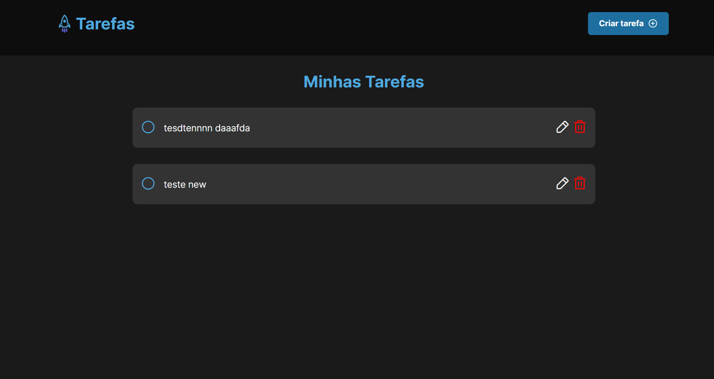

# Gerenciamento de Tarefas

Sistema de gerenciamento de tarefas utilizando o framework Laravel.



## Como rodar o projeto

### Inicair banco de dados Mysql no Docker

É nessesário ter o docker instalado

```bash
$ docker-compose up
```

### Executar Projeto

```bash
$ php artisan serve
```
